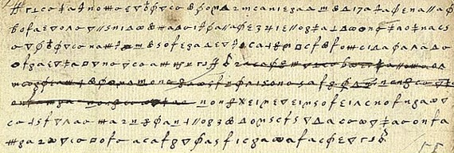
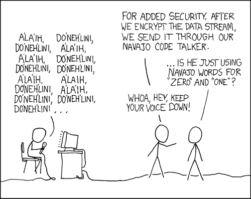
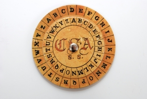
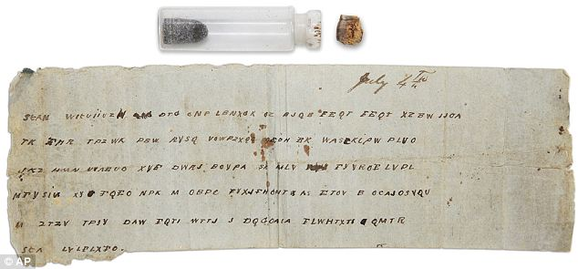
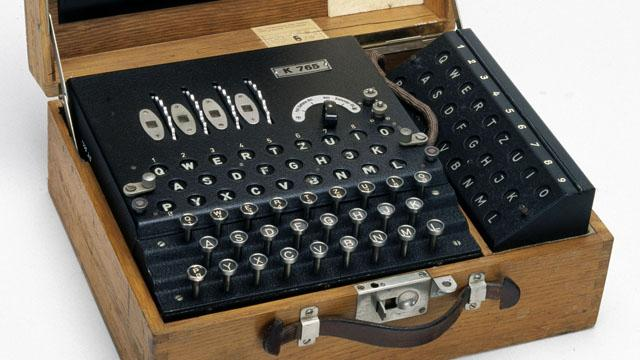
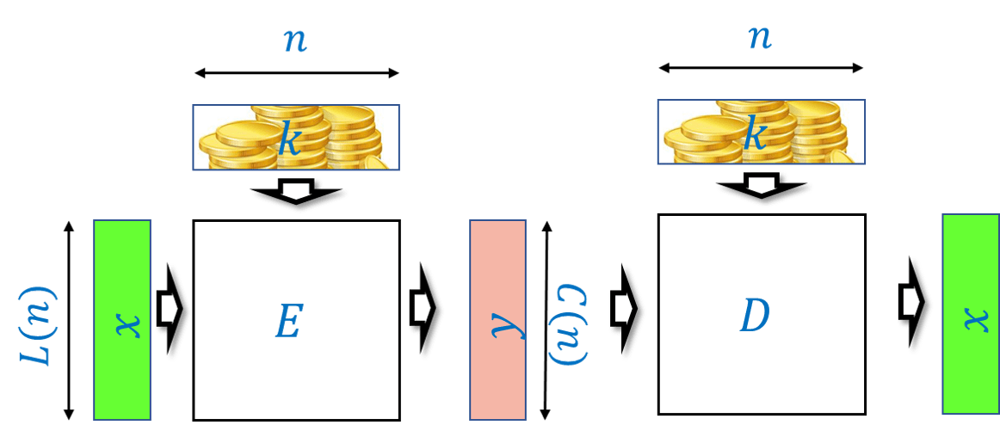

<!-- toc -->

# 密码学 { #chapcryptography }

## 学习目标 { .objectives }
* 完美保密性(perfect secrecy)的定义
* 一次性密码本加密方案(one-time pad encryption scheme)
* 完美保密性需要长密钥的必然性
* 计算安全性(computational secrecy)与去随机化的一次性密码本
* 公钥加密
* 前沿课题浅尝

```admonish quote
"人类才智创造出的任何密码，都将被人类才智破解。"

*-Edgar Allen Poe，1841年*
```

```admonish quote
"一个好的伪装不应暴露此人的身高。"

*-Shafi Goldwasser和Silvio Micali，1982年*
```

```admonish quote
"一个系统若满足：当敌人截获到密文后，该密文代表各消息的后验概率posteriori probability，与截获前这些消息本身的先验概率完全相同，则称该系统具有‘完美保密性’。研究表明，完美保密性是可以实现的，但若消息数量有限，则要求相同数量的可能密钥。"

*-Claude Shannon，1945年*
```

```admonish quote
"我们今天正站在密码学革命的门槛上。"

*-Whitfeld Diffie和Martin Hellman，1976年*
```

密码学——研究"秘密书写"的艺术或科学——已经存在了数千年。在这几乎所有的漫长岁月里，Edgar Allen Poe上面的那句名言都一直成立。的确，密码学的历史中充斥着那些曾被信为安全、尔后被攻破的密码系统的"形象化"的残骸，有时甚至包括那些错误地将信任寄托于这些密码系统的人们所留下的真实骸骨。

然而，在过去的几十年里，情况发生了变化，这正是指（并且在很大程度上由）上文引用的Diffie和Hellman于1976年的论文所预示的那场"革命"。人们已经找到了新型的密码系统，尽管遭到了巨大的破解努力——这些努力涉及的人类才智和计算能力的规模完全超越了Allen Poe时代的"密码破译者"，但它们至今仍未被攻破。更令人称奇的是，这些密码系统不仅看似牢不可破，而且是在更为严苛的条件下实现的。如今的攻击者不仅拥有更强大的计算能力，他们可供利用的数据也更多。在爱伦·坡的时代，攻击者若能获得少量几个已知消息的加密结果，就算很幸运了。而如今，攻击者可能拥有海量数据——TB级别甚至更多——可供其使用。实际上，有了**公钥**(public key)加密，攻击者甚至可以随心所欲地生成任意多的密文。

成功的关键在于，人们对于如何**定义**密码工具的安全性，以及如何将这种安全性与**具体的计算难题**联系起来，有了更清晰的理解。密码学是一个广阔且不断发展的领域，本章仅能触及其中部分内容。

```admonish info title = "本章：一个直观的概述"
密码学无法在一章的篇幅之内详尽解释，因此本章仅是对密码学的一次"浅尝"，重点关注其与计算复杂性理论最相关的方面。更全面的论述，请参阅[我的讲义](https://intensecrypto.org/)，本章即改编自该讲义。我们将讨论一些"经典密码系统"，并展示如何**从数学上定义**加密的安全性，以及如何使用**一次性密码本**(one-time pad)来实现一种可证明满足该定义的加密方法。随后，我们将看到该定义的根本局限性，以及为了规避这一局限，我们如何通过仅关注**计算资源有限**的攻击者来放宽安全性要求。这种**计算安全性**的概念与计算复杂性以及$\mathbf{P}$与$\mathbf{NP}$问题有着内在的联系。我们还将简要介绍一些远远超出传统加密范畴的"悖论式"的密码学构造，包括公钥密码学、全同态加密以及多方安全计算。
```

## 古典密码系统

历史上，人们设计出了大量的密码系统，而它们也相继被破译。在此，我们仅讲述其中几个故事。1587年，苏格兰女王Mary，也是当时英格兰王位的继承人，密谋刺杀她的表亲——英格兰女王Elizabeth一世，以便自己能登上王位，并最终摆脱已持续18年的软禁生活。作为这个复杂阴谋的一部分，她向Anthony Babington爵士发送了一封加密的信件。

```admonish pic id="maryscottletterfig"
 

{{pic}}{fig:maryscottletter} Mary女王与Babington爵士之间加密通信的片段
```

玛丽使用的是所谓的**替换加密**(substitution cipher)，其中每个字母都被转换成另一个晦涩的符号（见{{ref:fig:maryscottletter}}）。乍一看，这样一封信似乎相当费解——一串毫无意义的奇怪符号。然而，稍加思索，人们可能会注意到这些符号**重复**出现了多次，而且不同的符号重复的频率也不同。那么，我们不难推测，也许每个符号对应一个不同的字母，而出现更频繁的符号则对应字母表中出现频率更高的字母。基于这个观察，距离完全破解该密码就只差一小步了。事实上，伊丽莎白女王的间谍们正是这样做的，他们利用解码后的信件获知了所有同谋者，并给玛丽女王定了叛国罪，她因此被处决。迷信于表面的安全措施（例如使用"难以理解的"符号）是密码使用者们年复一年反复落入的陷阱。（正如许多事情一样，一部精彩的XKCD漫画也以此为题材，见{{ref:fig:XKCDnavajo}}。）

```admonish pic id="XKCDnavajofig"
 

{{pic}}{fig:XKCDnavajo} XKCD对于使用生僻符号能增加安全性的看法
```

[Vigenère加密](https://en.wikipedia.org/wiki/Vigen%C3%A8re_cipher)以Blaise de Vigenère的名字命名，他在1586年的一本书中描述了这种方法（尽管它是由Bellaso更早发明的）。其思想是使用一组替换加密：如果有$n$种不同的密码，那么明文的第一个字母用第一种密码编码，第二个字母用第二种密码，第$n$个字母用第$n$种密码，然后第$n+1$个字母再次用第一种密码编码。密钥$k$通常是一个由$n$个字母组成的单词或短语。第$i$种替换密码会将每个字母按照从A到$k_i$所需的相同偏移量进行移位。例如，如果$k_i$是C，那么第$i$种替换密码就会将每个字母向后移动两位。这种方法"抹平"了频率，使得频率分析变得困难得多，这也是为什么这种密码在300多年里被认为"不可破译"，并赢得了"不可破译的密码"（le chiffre indéchiffrable）绰号的原因。尽管如此，Charles Babbage还是在1854年破解了Vigenère加密（尽管他没有发表）。1863年，Friedrich Kasiski破译了该密码并发表了结果。其思路是，一旦你猜出了密钥的长度，就可以将任务简化为破解一个简单的替换加密，而后者可以通过频率分析来完成（你能想到为什么吗？）。美国内战期间，南方邦联的将军们经常使用维吉尼亚密码，而他们的信息也经常被联邦军官分析。

```admonish pic id="tmplabelfig1"
 

{{pic}}{fig:tmplabel1} 南方邦联用于进行Vigenère加密的密码盘
```

```admonish pic id="tmplabelfig2"
 

{{pic}}{fig:tmplabel2} 南方邦联的信息"Pemberton将军：你无法从河这边得到任何帮助。如有可能，请告知Johnston将军你何时能攻击敌军战线上的同一地点。也请通知我，我将尽力进行牵制。我已送去一些雷管。随信附上Johnston将军的一则快讯。"的加密结果
```

**Enigma**加密是一种机械密码机（外形像打字机，见{{ref:fig:enigma}}），每输入一个字母，会根据（相当复杂的）密钥和机器的当前状态映射成另一个不同的字母。机器的状态由几个以不同速度旋转的转子决定。另一端的相同布线的机器可用于解密。正如历史上的许多密码一样，德国人也相信它是"不可能被破译的"，甚至在战争后期，尽管有越来越多的证据表明它已被破译，他们仍拒绝相信这一事实。（事实上，一些德国将军甚至在**战后**都拒绝相信它被破译了。）破译Enigma是一项英勇的壮举，由波兰人发起，随后由英国人在Bletchley园完成，Alan Turing（就是图灵机的那个Turing）在其中扮演了关键角色。作为这项工作的一部分，英国人建造了可以说是世界上第一台大规模机械计算设备（尽管它们看起来更像洗衣机而不是iPhone）。在此过程中，德国操作员的一些操作失误和错误也帮了忙。例如，他们的信息以"希特勒万岁"结尾这一事实被证明非常有用。

```admonish pic id="enigmafig"
 

{{pic}}{fig:enigma} 在Enigma机械密码中，密钥是转子和内部接线的设置。当操作员键入信息时，加密版本会显示在上方的显示区，同时密码机的内部状态会更新（因此，两次输入同一个字母通常会产生两个不同的输出字母）。解密过程相同：如果发送方和接收方使用相同的密钥，那么键入密文就会在显示区出现明文。
```

这里有一个有趣的小故事：Enigma机永远不会将一个字母映射为它本身。1941年3月，Bletchley园的密码分析家Mavis Batey收到了一封试图解密的长信息。她随后注意到了一个奇特的性质——信息中完全没有出现字母"L"。{{脚注：这里有个不错的练习题：计算一封由随机字母组成的50个字母的信息不包含字母"L"的概率（估算数量级）。}} 她意识到信息中没有"L"的概率太小了，不可能是偶然发生的。因此她推测，原始信息一定**只**由L组成。也就是说，情况很可能是操作员（也许是为了测试机器）简单地反复按下字母"L"发送了一条信息。这一观察帮助她解码了下一条信息，这条信息揭示了意大利计划中的袭击，并帮助英军在后来被称为"马塔潘角海战"的战斗中取得了决定性的胜利。Mavis还帮助破译了另一台Enigma机。利用她提供的情报，英国人成功地让德国人相信，盟军的主要登陆地点是在加莱海峡，而不是诺曼底。

用Eisenhower将军的话来说，来自Bletchley园的情报具有"无价的价值"。它们对盟军的战争努力产生了巨大影响，从而缩短了第二次世界大战，挽救了数百万人的生命。另见[对Harry Hinsley爵士的采访](http://www.cix.co.uk/~klockstone/hinsley.htm)。

## 定义加密

历史上（直至今日！）加密系统设计者面临的许多问题，都可归因于最初未能正确定义或理解他们想要实现的目标。让我们聚焦于**私钥加密**(private key encryption)的场景。（这也被称为“对称加密”(symmetric encryption)；数千年来，“私钥加密”一直是加密的同义词，直到20世纪70年代**公钥加密**(public key encryption)的概念才被发明出来，见{{ref:def:publickeyencdef}}）**发送方**（传统上称为“Alice”）想要向**接收方**（传统上称为“Bob”）发送一条消息（也称为**明文**, plaintext）$x\in \{0,1\}^*$。他们希望消息对窃听或“窃听”通信信道（传统上称为“Eve”）的**敌手**保密。

Alice和Bob共享一个**密钥**(secret key)$k \in \{0,1\}^*$。（虽然本书其他地方常用字母$k$表示自然数，但在本章中，我们用其表示对应于密钥的字符串。）Alice使用密钥$k$将明文$x$“打乱”或**加密**成**密文**$y$，Bob使用密钥$k$将密文$y$“恢复”或**解密**回明文$x$。这促使我们给出以下定义，该定义试图描述无论加密方案是否**安全**，它要**有效**或“有意义”所需满足的条件：

```admonish quote title=""
{{defc}}{def:encryptiondef}[有效加密方案]
**定义21.1：有效加密方案**
令$L:\N \rightarrow \N$和$C:\N \rightarrow \N$为两个从自然数映射到自然数的函数。一对将字符串映射到字符串的多项式时间可计算函数$(E,D)$，如果对于每个$n\in \N$，$k\in \{0,1\}^n$和$x \in \{0,1\}^{L(n)}$，都有$|E_k(x)|= C(n)$ 且 
$$
D(k,E(k,x))=x \;. {{numeq}}{eq:eqvalidenc}
$$
则称其为具有明文长度函数$L(\cdot)$和密文长度函数$C(\cdot)$的**有效私钥加密方案**（valid private key scheme, 简称**加密方案**encryption scheme）。
```

我们经常将加密和解密的第一个输入（即密钥）写作下标，因此{{eqref:eq:eqvalidenc}}也可写为$D_k(E_k(x))=x$。

```admonish pic id="validencryption"
 

{{pic}}{fig:validencryption} 私钥加密方案是一对算法$E,D$，使得对于每个密钥$k\in \{0,1\}^n$和明文$x\in \{0,1\}^{L(n)}$，$y=E_k(x)$是长度为$C(n)$的密文。如果对于每个这样的$y$，都有$D_k(y)=x$，则该加密方案是**有效的**。也就是说，只要加密和解密使用相同的密钥，对$x$加密后再解密的结果就是$x$。
```

```admonish question
{{exec}}{exe:lengthsciphertextplaintext}[密文与明文的长度]

证明：对于任何具有函数$L,C$的有效加密方案$(E,D)$，对于每个$n$，都有$C(n) \geq L(n)$。
```

```admonish solution collapsible=true title="对{{ref:exe:lengthsciphertextplaintext}}的解答"
对于每个固定的密钥$k \in \{0,1\}^n$，方程{{eqref:eq:eqvalidenc}}表明映射$y \mapsto D_k(y)$是映射$x \mapsto E_k(x)$的逆映射，这尤其意味着映射$x \mapsto E_k(x)$必须是单射。因此，其陪域必须至少与其定义域一样大，由于其定义域是$\{0,1\}^{L(n)}$，陪域是$\{0,1\}^{C(n)}$，因此可得$C(n) \geq L(n)$。
```

由于密文长度始终至少等于明文长度（并且在大多数应用中，它不会比明文长度长很多），我们通常将明文长度作为加密方案中需要优化的量。$L(n)$**越大**，方案就越好，因为这意味着保护相同长度的消息所需的密钥更短。

## 定义加密的安全性

{{ref:def:encryptiondef}}完全没有提及$E$和$D$的**安全性**，甚至允许那种完全忽略密钥、对所有$x$都设$E_k(x)=x$的平凡加密方案存在。定义安全性并非易事。

```admonish pause title="暂停一下"
如果你在此处暂停阅读五分钟，试着（或许与同伴一起）集思广益，思考如何用数学语言定义加密方案是**安全的**，即它能保护明文$x$的**保密性**，你将更能体会到定义加密安全性的精妙之处。
```

纵观历史，许多对密码系统的攻击，其根源都在于密码系统设计者依赖"隐匿安全性"——相信他们的**方法**不为敌人所知就能保护其不被破解。这是一个错误的假设——如果你反复使用同一种方法（即使每次都更换密钥），你的对手最终会弄清楚你在做什么。而且，如果Alice和Bob频繁地在安全地点会面以决定新方法，他们还不如直接利用这个机会交换秘密。这些考量促使Auguste Kerckhoffs于1883年提出了以下原则：

```admonish quote
*一个密码系统，即使除密钥之外的整个系统的所有信息都是公开的，也应该是安全的。*{{footnote: 原文是 "Il faut qu’il n'exige pas le secret, et qu'il puisse sans inconvénient tomber entre les mains de l'ennemi"，大意是"系统不能要求保密，且即便落入敌人手中也不应带来麻烦"。据史蒂夫·贝洛文所述，美国国家安全局的版本是"假设我们制造的任何设备的第一个副本都运往了克里姆林宫"。}}
```

为什么假设密钥是保密的而算法可以公开是可行的？因为我们总能选择一个新的密钥。当然，如果我们的密钥是"1234"或"password！"，那也于事无补。事实上，如果你使用**任何**确定性的算法来选择密钥，你的对手最终也能搞清楚这一点。因此，为了安全，我们必须**随机地**选择密钥，并且可以将Kerckhoffs原则重申如下：

```admonish quote
*没有随机性，就没有保密性*
```

这一点至关重要，值得重申：

```admonish bigidea
{{idec}}{ide:securityrandomness}

没有**随机性**，就没有**保密性**。
```

每个密码方案的核心都有一个密钥，而这个密钥总是随机选择的。其必然结论是，要理解密码学，你需要懂概率论。

```admonish info
{{remc}}{rem:randomnessinlife}[现实世界中的随机性]

为密码学选择密钥需要生成随机性，这通常通过测量一些"不可预测"或"高熵"的数据，然后对其应用哈希函数以"提取"出均匀随机的字符串来完成。此过程必须极其谨慎，随机数生成器往往成为安全系统的"阿喀琉斯之踵"。

2006年，一位程序员从Debian分发的OpenSSL软件包中的熵生成过程中删除了几行代码，因为它们在某个自动验证代码中引起了警告。结果在长达两年的时间里（直到问题被发现），该过程生成的所有随机数仅使用进程ID作为"不可预测"的来源。这意味着在此期间用户进行的所有通信都相当容易被破解（而且，如果某些实体记录了这些通信，他们甚至可以事后追溯性地破解它们）。参见[XKCD对此事件的趣谈](http://www.xkcd.com/424/)。

2012年，两个独立的研究团队扫描了网络上大量的RSA密钥，发现其中约4%的密钥很容易被破解。主要问题出在路由器、联网打印机等设备上。这些设备有时运行的是Linux的变体——一种桌面操作系统——但由于没有硬盘、鼠标或键盘，它们无法获得桌面机所拥有的许多熵源。再加上一些老派的无知（指对密码学的无知）和软件缺陷，导致大量密钥极易被破解，详情见[这篇博文](https://freedom-to-tinker.com/blog/nadiah/new-research-theres-no-need-panic-over-factorable-keys-just-mind-your-ps-and-qs/)和[这个网页](https://factorable.net/)。

由于随机性对安全性至关重要，破坏生成随机性的过程可能导致使用该随机性的系统完全崩溃。事实上，Snowden泄露的文件，结合Shumow和Ferguson的观察，[强烈暗示](https://en.wikipedia.org/wiki/Dual_EC_DRBG)美国国家安全局在美国国家标准与技术研究院发布的一个伪随机数生成器中故意插入了**后门**。幸运的是，这个生成器没有被广泛采用，但显然美国国家安全局确实向RSA安全公司支付了1000万美元，以便后者将这个生成器设为它们产品的默认选项。
```

## Perfect secrecy

If you think about encryption scheme security for a while, you might come up with the following principle for defining security: _"An encryption scheme is secure if it is not possible to recover the key $k$ from $E_k(x)$"_.
However,  a moment's thought shows that the key is not really what we're trying to protect.
After all, the whole point of an encryption is to protect the confidentiality of the _plaintext_ $x$.
So, we can try to define that _"an encryption scheme is secure if it is not possible to recover the plaintext $x$ from $E_k(x)$"_.
Yet it is not clear what this means either.
Suppose that an encryption scheme reveals the first 10 bits of the plaintext $x$.
It might still not be possible to recover $x$ completely, but on an intuitive level, this seems like it would be extremely unwise to use such an encryption scheme in practice.
Indeed, often even _partial information_ about the plaintext is enough for the adversary to achieve its goals.

The above thinking led Shannon in 1945 to formalize the notion of _perfect secrecy_, which is that an encryption reveals absolutely nothing about the message.
There are several equivalent ways to define it, but perhaps the cleanest one is the following:

::: {.definition title="Perfect secrecy" #perfectsecrecy}
A valid encryption scheme $(E,D)$ with plaintext length $L(\cdot)$ is _perfectly secret_ if for every $n\in \N$ and plaintexts $x,x' \in \{0,1\}^{L(n)}$, the following two distributions $Y$ and $Y'$ over $\{0,1\}^*$ are identical:

* $Y$ is obtained by sampling  $k\sim \{0,1\}^n$ and outputting $E_k(x)$.

* $Y'$ is obtained by sampling  $k\sim \{0,1\}^n$ and outputting $E_k(x')$.
:::

::: { .pause }
This definition might take more than one reading to parse. Try to think of how this condition would correspond to your intuitive notion of "learning no information" about $x$ from observing $E_k(x)$, and to Shannon's quote in the beginning of this chapter.

In particular, suppose that you knew ahead of time that Alice sent either an encryption of $x$ or an encryption of $x'$. Would you learn anything new from observing the encryption of the message that Alice actually sent? It may help you to look at [perfectsecfig](){.ref}.
:::


![For any key length $n$, we can visualize an encryption scheme $(E,D)$ as a graph with a vertex for every one of the $2^{L(n)}$ possible plaintexts and for every one of the ciphertexts in $\{0,1\}^*$ of the form $E_k(x)$ for $k\in \{0,1\}^n$ and $x\in \{0,1\}^{L(n)}$. For every plaintext $x$ and key $k$, we add an edge labeled $k$ between $x$ and $E_k(x)$. By the validity condition, if we pick any fixed key $k$, the map $x \mapsto E_k(x)$ must be one-to-one. The condition of perfect secrecy simply corresponds to requiring that every two    plaintexts $x$ and $x'$ have exactly the same set of neighbors (or multi-set, if there are parallel edges).](../figure/perfectsecrecy.png){#perfectsecfig .margin  }

### Example: Perfect secrecy in the battlefield

To understand [perfectsecrecy](){.ref}, suppose that Alice sends only one of two possible messages: "attack" or "retreat", which we denote by $x_0$ and $x_1$ respectively, and that she sends each one of those messages with probability $1/2$.
Let us put ourselves in the shoes of _Eve_, the eavesdropping adversary.
A priori we would have guessed that Alice sent either $x_0$ or $x_1$ with probability $1/2$.
Now we observe $y=E_k(x_i)$ where $k$ is a uniformly chosen key in $\{0,1\}^n$.
How does this new information cause us to update our beliefs on whether Alice sent the plaintext $x_0$ or the plaintext $x_1$?

> ### { .pause }
Before reading the next paragraph, you might want to try the analysis yourself.
You may find it useful to look at the [Wikipedia entry on Bayesian Inference](https://en.wikipedia.org/wiki/Bayesian_inference) or [these MIT lecture notes](https://ocw.mit.edu/courses/mathematics/18-05-introduction-to-probability-and-statistics-spring-2014/readings/MIT18_05S14_Reading11.pdf).

Let us define $p_0(y)$ to be the probability (taken over $k\sim \{0,1\}^n$) that $y=E_k(x_0)$ and similarly $p_1(y)$ to be $\Pr_{k \sim \{0,1\}^n}[y=E_k(x_1)]$.
Note that, since Alice chooses the message to send at random, our a priori probability for observing $y$ is $\tfrac{1}{2}p_0(y) + \tfrac{1}{2}p_1(y)$.
However, as per [perfectsecrecy](){.ref},   the perfect secrecy condition guarantees that $p_0(y)=p_1(y)$!
Let us denote the number $p_0(y)=p_1(y)$ by $p$.
By the formula for conditional probability, the probability that Alice sent the message $x_0$ conditioned on our observation $y$ is simply
$$
\Pr[i=0 | y=E_k(x_i)] = \frac{\Pr[i=0 \wedge y = E_k(x_i)]}{\Pr[y = E_k(x)]} \;. \label{bayeseq}
$$

(The equation [bayeseq](){.eqref} is a special case of _Bayes' rule_ which, although a simple restatement of the formula for conditional probability, is an extremely important and widely used tool in statistics and data analysis.)

Since the probability that $i=0$ and $y$ is the ciphertext $E_k(0)$ is equal to $\tfrac{1}{2}\cdot p_0(y)$, and the a priori probability of observing $y$ is $\tfrac{1}{2}p_0(y) + \tfrac{1}{2}p_1(y)$,
we can rewrite [bayeseq](){.eqref} as
$$
\Pr[i=0 | y=E_k(x_i)] = \frac{\tfrac{1}{2}p_0(y)}{\tfrac{1}{2}p_0(y)+\tfrac{1}{2}p_1(y)}  =  \frac{p}{p +p}  = \frac{1}{2}
$$
using the fact that $p_0(y)=p_1(y)=p$.
This means that observing the ciphertext $y$ did not help us at all! We still would not be able to guess whether Alice sent "attack" or "retreat" with better than 50/50 odds!

This example can be vastly generalized to show that perfect secrecy is indeed "perfect" in the sense that observing a ciphertext gives Eve _no additional information_ about the plaintext beyond her a priori knowledge.

### Constructing perfectly secret encryption

_Perfect secrecy_ is an extremely strong condition, and implies that an eavesdropper does not learn _any_ information from observing the ciphertext.
You might think that an encryption scheme satisfying such a strong condition will be impossible, or at least extremely complicated, to achieve.
However it turns out we can in fact obtain a perfectly secret encryption scheme fairly easily.
Such a scheme for two-bit messages is illustrated in [onetimepadtwofig](){.ref}.


![A perfectly secret encryption scheme for two-bit keys and messages. The blue vertices represent plaintexts and the red vertices represent ciphertexts, each edge mapping a plaintext $x$ to a ciphertext $y=E_k(x)$ is labeled with the corresponding key $k$. Since there are four possible keys, the degree of the graph is four and it is in fact a complete bipartite graph. The encryption scheme is valid in the sense that for every $k\in \{0,1\}^2$, the map $x \mapsto E_k(x)$ is one-to-one, which in other words means that the set of edges labeled with $k$ is a _matching_.](../figure/onetimepadtwobits.png){#onetimepadtwofig .margin  }

In fact, this can be generalized to any number of bits:


> ### {.theorem title="One Time Pad (Vernam 1917, Shannon 1949)" #onetimepad}
There is a perfectly secret valid encryption scheme $(E,D)$ with $L(n)=C(n)=n$.

> ### {.proofidea data-ref="onetimepad"}
Our scheme is the [one-time pad](https://en.wikipedia.org/wiki/One-time_pad) also known as the "Vernam Cipher", see [onetimepadfig](){.ref}.
The encryption is exceedingly simple: to encrypt a message $x\in \{0,1\}^n$ with a key $k \in \{0,1\}^n$ we simply output $x \oplus k$ where $\oplus$ is the bitwise XOR operation that
outputs the string corresponding to XORing each coordinate of $x$ and $k$.


::: {.proof data-ref="onetimepad"}
For two binary strings $a$ and $b$ of the same length $n$, we define $a \oplus b$ to be the string $c \in \{0,1\}^n$ such that $c_i = a_i + b_i \mod 2$ for every $i\in [n]$.
The encryption scheme $(E,D)$ is defined as follows: $E_k(x) = x\oplus k$ and $D_k(y)= y \oplus k$.
By the associative law of addition (which works also modulo two), $D_k(E_k(x))=(x\oplus k) \oplus k = x \oplus (k \oplus k) = x \oplus 0^n = x$,
using the fact that for every bit $\sigma \in \{0,1\}$, $\sigma + \sigma \mod 2 = 0$ and $\sigma + 0 = \sigma \mod 2$.
Hence $(E,D)$ form a valid encryption.

To analyze the perfect secrecy property, we claim that for every $x\in \{0,1\}^n$, the distribution $Y_x=E_k(x)$ where $k \sim \{0,1\}^n$ is simply the uniform distribution over $\{0,1\}^n$, and hence in particular the distributions $Y_{x}$ and $Y_{x'}$ are identical for every $x,x' \in \{0,1\}^n$.
Indeed, for every particular $y\in \{0,1\}^n$, the value $y$ is output by $Y_x$ if and only if $y = x \oplus k$ which holds if and only if $k= x \oplus y$. Since $k$ is chosen uniformly at random in $\{0,1\}^n$, the probability that $k$ happens to equal $x \oplus y$ is exactly $2^{-n}$, which means that every string $y$ is output by $Y_x$ with probability $2^{-n}$.
:::


{#onetimepadfig .margin  }


> ### { .pause }
The argument above is quite simple but is worth reading again. To understand why the one-time pad is perfectly secret, it is useful to envision it as a bipartite graph as we've done in [onetimepadtwofig](){.ref}.
(In fact the encryption scheme of [onetimepadtwofig](){.ref} is precisely the one-time pad for $n=2$.) For every $n$, the one-time pad encryption scheme corresponds to a bipartite graph with $2^n$  vertices on the "left side" corresponding to the plaintexts in $\{0,1\}^n$ and $2^n$  vertices on the "right side" corresponding to the ciphertexts $\{0,1\}^n$.
For every $x\in \{0,1\}^n$ and $k\in \{0,1\}^n$, we connect $x$ to the vertex $y=E_k(x)$ with an edge that we label with $k$.
One can see that this is the complete bipartite graph, where every vertex on the left is connected to _all_ vertices on the right.
In particular this means that for every left vertex $x$, the distribution on the ciphertexts obtained by taking a random $k\in \{0,1\}^n$ and going to the neighbor of $x$ on the edge labeled $k$ is the uniform distribution over $\{0,1\}^n$.
This ensures the perfect secrecy condition.

## Necessity of long keys

So, does [onetimepad](){.ref} give the final word on cryptography, and means that we can all communicate with perfect secrecy and live happily ever after?
No it doesn't.
While the one-time pad is efficient, and gives perfect secrecy, it has one glaring disadvantage: to communicate $n$ bits you need to store a key of length $n$.
In contrast, practically used cryptosystems such as AES-128 have a short key of $128$ bits (i.e., $16$ bytes) that can be used to protect terabytes or more of communication!
Imagine that we all needed to use the one time pad.
If that was the case, then if you had to communicate with $m$ people, you would have to maintain (securely!)
$m$ huge files that are each as long as the length of the maximum total communication you expect with that person.
Imagine that every time you opened an account with Amazon, Google, or any other service, they would need to send you in the mail (ideally with a secure courier) a DVD full of random numbers,
and every time you suspected a virus, you'd need to ask all these services for a fresh DVD. This doesn't sound so appealing.


This is not just a theoretical issue.
The Soviets have used the one-time pad for their confidential communication since before the 1940's.
In fact,  even before Shannon's work, the U.S. intelligence already knew in 1941 that the one-time pad is in principle "unbreakable"  (see page 32 in the [Venona document](http://nsarchive.gwu.edu/NSAEBB/NSAEBB278/01.PDF)).
However, it turned out that the hassle of manufacturing so many keys for all the communication took its toll on the Soviets and they ended up reusing the same keys
for more than one message.  They did try to use them for completely different receivers in the (false) hope that this wouldn't be detected.
The [Venona Project](https://en.wikipedia.org/wiki/Venona_project) of the U.S. Army was founded in February 1943 by Gene Grabeel (see [genegrabeelfig](){.ref}), a former home economics teacher from Madison Heights, Virgnia and Lt. Leonard Zubko.
In October 1943, they had their breakthrough when it was discovered that the Russians were reusing their keys.
In the 37 years of its existence, the project has resulted in a treasure chest of intelligence, exposing hundreds of KGB agents and Russian spies in the U.S. and other countries,
including Julius Rosenberg, Harry Gold, Klaus Fuchs, Alger Hiss, Harry Dexter White and many others.

{#genegrabeelfig .margin  }


{#longkeygraphfig .margin  }


Unfortunately it turns out that such long keys are _necessary_ for perfect secrecy:

> ### {.theorem title="Perfect secrecy requires long keys" #longkeysthm}
For every perfectly secret encryption scheme $(E,D)$ the length function $L$ satisfies $L(n) \leq n$.

> ### {.proofidea data-ref="longkeysthm"}
The idea behind the proof is illustrated in [longkeygraphfig](){.ref}. We define a graph between the plaintexts and ciphertexts, where we put an edge between plaintext $x$ and ciphertext $y$ if there is some key $k$ such that  $y=E_k(x)$. The _degree_ of this graph is at most the number of potential keys. The fact that the degree is smaller than the number of plaintexts (and hence of ciphertexts) implies that there would be two plaintexts $x$ and $x'$ with different sets of neighbors, and hence the distribution of a ciphertext corresponding to $x$ (with a random key) will not be identical to the distribution of a ciphertext corresponding to $x'$. 

::: {.proof data-ref="longkeysthm"}
Let $E,D$ be a valid encryption scheme with messages of length $L$ and key of length $n<L$.
We will show that $(E,D)$ is not perfectly secret by providing two plaintexts $x_0,x_1 \in \{0,1\}^L$ such that the distributions $Y_{x_0}$ and $Y_{x_1}$ are not identical, where $Y_x$ is the distribution obtained by picking $k \sim \{0,1\}^n$ and outputting $E_k(x)$.


We choose $x_0 = 0^L$.
Let $S_0 \subseteq \{0,1\}^*$ be the set of all ciphertexts that have non-zero probability of being output in $Y_{x_0}$. That is, $S_0=\{ y \;|\; \exists_{k\in \{0,1\}^n} y=E_k(x_0) \}$.
Since there are only $2^n$ keys, we know that $|S_0| \leq 2^n$.


We will show the following claim:

__Claim I:__ There exists some $x_1 \in \{0,1\}^L$ and $k\in \{0,1\}^n$ such that $E_k(x_1) \not\in S_0$.


Claim I implies that the string $E_k(x_1)$ has positive probability of being output by $Y_{x_1}$  and zero probability of being output by $Y_{x_0}$ and hence in particular $Y_{x_0}$ and $Y_{x_1}$ are not identical.
To prove Claim I, just choose a fixed $k\in \{0,1\}^n$. By the validity condition, the map $x \mapsto E_k(x)$ is a one to one map of $\{0,1\}^L$ to $\{0,1\}^*$ and hence in particular
the _image_ of this map which is the set $I_k = \{ y \;|\; \exists_{x\in \{0,1\}^L} y=E_k(x) \}$ has size at least (in fact exactly) $2^L$.
Since $|S_0| \leq 2^n < 2^L$, this means that $|I_k|>|S_0|$ and so in particular there exists some string $y$ in $I_k \setminus S_0$. But by the definition of $I_k$ this means that there is some $x\in \{0,1\}^L$  such that $E_k(x) \not\in S_0$ which concludes the proof of Claim I and hence of  [longkeysthm](){.ref}.
:::


## Computational secrecy

To sum up the previous episodes, we now know that:

* It is possible to obtain a perfectly secret encryption scheme with key length the same as the plaintext.

and

* It is not possible to obtain such a scheme with key that is even a single bit shorter than the plaintext.

How does this mesh with the fact that, as we've already seen, people routinely use cryptosystems with a 16 byte (i.e., 128 bit)  key but many terabytes of plaintext?
The proof of [longkeysthm](){.ref} does give in fact a way to break all these cryptosystems, but an examination of this proof shows that it only yields an algorithm with time _exponential in the length of the key_.
This motivates the following relaxation of perfect secrecy to a condition known as _"computational secrecy"_.
Intuitively, an encryption scheme is computationally secret if no polynomial time algorithm can break it.
The formal definition is below:

::: {.definition title="Computational secrecy" #compsecdef}
Let $(E,D)$ be a valid encryption scheme where for keys of length $n$, the plaintexts are of length $L(n)$ and the ciphertexts are of length $m(n)$.
We say that $(E,D)$ is _computationally secret_ if for every polynomial $p:\N \rightarrow \N$, and large enough $n$, if $P$ is an $m(n)$-input and single output NAND-CIRC program of at most $p(n)$ lines, and $x_0,x_1 \in \{0,1\}^{L(n)}$  then

$$
\left| \E_{k \sim \{0,1\}^n} [P(E_k(x_0))] -   \E_{k \sim \{0,1\}^n} [P(E_k(x_1))] \right| < \tfrac{1}{p(n)} \label{eqindist}
$$
:::

> ### { .pause }
[compsecdef](){.ref} requires a second or third read and some practice to truly understand.
One excellent exercise to make sure you follow it is to see that if we allow $P$ to be an _arbitrary_ function mapping $\{0,1\}^{m(n)}$ to $\{0,1\}$, and we replace the condition in [eqindist](){.eqref} that the left-hand side is smaller than $\tfrac{1}{p(n)}$ with the condition that it is equal to $0$ then we get the perfect secrecy condition of [perfectsecrecy](){.ref}.
Indeed if the distributions $E_k(x_0)$  and $E_k(x_1)$ are identical then applying any function $P$ to them we get the same expectation.
On the other hand, if the two distributions above give a different probability for some element $y^*\in \{0,1\}^{m(n)}$, then the function $P(y)$ that outputs $1$ iff $y=y^*$ will have a different expectation under the former distribution than under the latter.


[compsecdef](){.ref} raises two natural questions:

* Is it strong enough to ensure that a computationally secret encryption scheme protects the secrecy of messages that are encrypted with it?

* It is weak enough that, unlike perfect secrecy, it is possible to obtain a computationally secret encryption scheme where the key is much smaller than the message?

To the best of our knowledge, the answer to both questions is _Yes_.
This is just one example of a much broader phenomenon.
We can use computational hardness to achieve many cryptographic goals, including some goals that have been dreamed about for millenia, and other goals that people have not even dared to imagine.

::: { .bigidea #computationcrypto}
_Computational hardness_ is _necessary and sufficient_ for almost all cryptographic applications.
:::


Regarding the first question, it is not hard to show that if, for example,  Alice uses a computationally secret encryption algorithm to encrypt either "attack" or "retreat" (each chosen with probability $1/2$), then as long as she's restricted to polynomial-time algorithms, an adversary Eve will not be able to guess the message with probability better than, say, $0.51$, even after observing its encrypted form. (We omit the proof, but it is an excellent exercise for you to work it out on your own.)

To answer the second question we will show that under the same assumption we used for derandomizing $\mathbf{BPP}$, we can obtain a computationally secret cryptosystem where the key is almost _exponentially_ smaller than the plaintext.

### Stream ciphers or the "derandomized one-time pad"

It turns out that if pseudorandom generators exist as in the optimal PRG conjecture, then there exists a computationally secret encryption scheme with keys that are much shorter than the plaintext.
The construction below is known as a [stream cipher](https://en.wikipedia.org/wiki/Stream_cipher), though perhaps a better name is the "derandomized one-time pad".
It is widely used in practice with keys on the order of a few tens or hundreds of bits protecting many terabytes or even petabytes of communication.


{#derandonetimepadfig .margin  }


We start by recalling the notion of a _pseudorandom generator_, as defined in [prgdef](){.ref}.
For this chapter, we will fix a special case of the definition:

::: {.definition title="Cryptographic pseudorandom generator" #cryptoprg}
Let $L:\N \rightarrow \N$ be some function. A _cryptographic pseudorandom generator_ with stretch $L(\cdot)$ is a polynomial-time computable function $G:\{0,1\}^* \rightarrow \{0,1\}^*$ such that:

* For every $n\in \N$ and $s\in \{0,1\}^n$, $|G(s)|=L(n)$.

* For every polynomial $p:\N \rightarrow \N$ and $n$ large enough, if $C$ is a circuit of $L(n)$ inputs, one output, and at most $p(n)$ gates then
$$
\left| \Pr_{s\sim \{0,1\}^\ell}[C(G(s))=1] - \Pr_{r \sim \{0,1\}^m}[C(r)=1] \right| < \frac{1}{p(n)} \;.
$$
:::

In this chapter we will call a cryptographic pseudorandom generator simply a _pseudorandom generator_ or PRG for short. The optimal PRG conjecture of [optimalprgconj](){.ref} implies
that there is a pseudorandom generator that can "fool" circuits of _exponential size_ and where the gap in probabilities is at most one over an exponential quantity.
Since exponential grow faster than every polynomial, the optimal PRG conjecture implies the following:

>__The crypto PRG conjecture:__ For every $a \in \N$, there is a cryptographic pseudorandom generator with $L(n)=n^a$.


The crypto PRG conjecture is a weaker conjecture than the optimal PRG conjecture, but it too (as we will see) is still stronger than the conjecture that $\mathbf{P} \neq \mathbf{NP}$.


> ### {.theorem title="Derandomized one-time pad" #PRGtoENC}
Suppose that the crypto PRG conjecture is true.
Then for every constant $a\in \N$ there is   a computationally secret encryption scheme $(E,D)$ with plaintext length $L(n)$ at least $n^a$.

> ### {.proofidea data-ref="PRGtoENC"}
The proof is illustrated in [derandonetimepadfig](){.ref}. We simply take the one-time pad on $L$ bit plaintexts, but replace the key with $G(k)$ where $k$ is a string in $\{0,1\}^n$ and $G:\{0,1\}^n \rightarrow \{0,1\}^L$ is a pseudorandom generator. Since the one time pad cannot be broken, an adversary that breaks the derandomized one-time pad can be used to distinguish between the output of the pseudorandom generator and the uniform distribution.

::: {.proof data-ref="PRGtoENC"}
Let  $G:\{0,1\}^n \rightarrow \{0,1\}^L$  for $L = n^a$ be the restriction to input length $n$ of the pseudorandom generator $G$ whose existence we are guaranteed from the crypto PRG conjecture.
We now define our encryption scheme as follows: given key $k\in \{0,1\}^n$ and plaintext $x\in \{0,1\}^L$, the encryption $E_k(x)$ is simply $x \oplus G(k)$.
To decrypt a string $y \in \{0,1\}^m$ we output $y \oplus G(k)$.
This is a valid encryption since $G$ is computable in polynomial time and $(x \oplus G(k)) \oplus G(k) = x \oplus (G(k) \oplus G(k))=x$ for every $x\in \{0,1\}^L$.

Computational secrecy follows from the condition of a pseudorandom generator.
Suppose, towards a contradiction, that there is a polynomial $p$, NAND-CIRC program $Q$ of at most $p(L)$ lines and  $x,x' \in \{0,1\}^{L(n)}$  such that
$$
\left| \E_{k \sim \{0,1\}^n}[ Q(E_k(x))] - \E_{k \sim \{0,1\}^n}[Q(E_k(x'))] \right| > \tfrac{1}{p(L)} \;.
$$
(We use here the simple fact that for a  $\{0,1\}$-valued random variable $X$, $\Pr[X=1]=\E[X]$.)

By the definition of our encryption scheme, this means that
$$
\left| \E_{k \sim \{0,1\}^n}[ Q(G(k) \oplus x)] - \E_{k \sim \{0,1\}^n}[Q(G(k) \oplus x')] \right| > \tfrac{1}{p(L)} \;. \label{eqprgsecone}
$$

Now since (as we saw in the security analysis of the one-time pad), for every strings $x,x'\in \{0,1\}^L$, the distribution $r \oplus x$ and $r \oplus x'$ are identical, where $r\sim \{0,1\}^L$.
Hence
$$
\E_{r \sim \{0,1\}^L} [ Q(r \oplus x)] =  \E_{r \sim \{0,1\}^L} [ Q(r \oplus x')]  \;.  \label{eqprgsectwo}
$$
By plugging [eqprgsectwo](){.eqref} into [eqprgsecone](){.eqref}  we can derive that
$$
\left| \E_{k \sim \{0,1\}^n}[ Q(G(k) \oplus x)] - \E_{r \sim \{0,1\}^L} [ Q(r \oplus x)] +  \E_{r \sim \{0,1\}^L} [ Q(r \oplus x')]  -  \E_{k \sim \{0,1\}^n}[Q(G(k) \oplus x')] \right| > \tfrac{1}{p(L)} \;. \label{eqprgsethree}
$$
(Please make sure that you can see why this is true.)

Now we can use the _triangle inequality_ that $|A+B| \leq |A|+|B|$ for every two numbers $A,B$, applying it for $A= \E_{k \sim \{0,1\}^n}[ Q(G(k) \oplus x)] - \E_{r \sim \{0,1\}^L} [ Q(r \oplus x)]$ and $B= \E_{r \sim \{0,1\}^L} [ Q(r \oplus x')]  -  \E_{k \sim \{0,1\}^n}[Q(G(k) \oplus x')]$ to derive
$$
\left| \E_{k \sim \{0,1\}^n}[ Q(G(k) \oplus x)] - \E_{r \sim \{0,1\}^L} [ Q(r \oplus x)] \right| + \left|  \E_{r \sim \{0,1\}^L} [ Q(r \oplus x')]  -  \E_{k \sim \{0,1\}^n}[Q(G(k) \oplus x')] \right| > \tfrac{1}{p(L)} \;. \label{eqprgsefour}
$$

In particular, either the first term or the second term of the left-hand side of [eqprgsefour](){.eqref} must be at least $\tfrac{1}{2p(L)}$.
Let us assume the first case holds (the second case is analyzed in exactly the same way).
Then we get that
$$
\left| \E_{k \sim \{0,1\}^n}[ Q(G(k) \oplus x)] - \E_{r \sim \{0,1\}^L} [ Q(r \oplus x)] \right| > \tfrac{1}{2p(L)} \;. \label{distingprgeq}
$$

But if we now define the NAND-CIRC program $P_x$ that on input $r\in \{0,1\}^L$ outputs $Q(r \oplus x)$ then (since XOR of $L$ bits can be computed in $O(L)$ lines), we get that $P_x$ has $p(L)+O(L)$ lines and by [distingprgeq](){.eqref} it can distinguish between an input of the form $G(k)$ and an input of the form $r \sim \{0,1\}^k$ with advantage better than $\tfrac{1}{2p(L)}$.
Since a polynomial is dominated by an exponential, if we make $L$ large enough, this will contradict the $(2^{\delta n},2^{-\delta n})$ security of the pseudorandom generator $G$.
:::


> ### {.remark title="Stream ciphers in practice" #streamciphersrem}
The two most widely used forms of (private key) encryption schemes in practice are _stream ciphers_ and _block ciphers_. (To make things more confusing, a block cipher is always used in some [mode of operation](https://en.wikipedia.org/wiki/Block_cipher_mode_of_operation) and some of these modes effectively turn a block cipher into a stream cipher.)
A block cipher can be thought as a sort of a "random invertible map" from $\{0,1\}^n$ to $\{0,1\}^n$, and can be used to construct a pseudorandom generator and from it a stream cipher, or to encrypt data directly using other modes of operations.
There are a great many other security notions and considerations for encryption schemes beyond computational secrecy.
Many of those involve handling scenarios such as _chosen plaintext_, _man in the middle_, and _chosen ciphertext_ attacks, where the adversary is not just merely a passive eavesdropper but can influence the communication in some way.
While this chapter is meant to give you some taste of the ideas behind cryptography, there is much more to know before applying it correctly to obtain secure applications, and a great many people have managed to get it wrong.

## Computational secrecy and $\mathbf{NP}$

We've also mentioned before that an efficient algorithm for $\mathbf{NP}$ could be used to break all cryptography.
We now give an example of how this can be done:

::: {.theorem title="Breaking encryption using $\mathbf{NP}$ algorithm" #breakingcryptowithnp}
If $\mathbf{P}=\mathbf{NP}$ then there is no computationally secret encryption scheme with $L(n) > n$.

Furthermore, for every valid encryption scheme $(E,D)$ with $L(n) > n+100$ there is a polynomial $p$ such that for every large enough $n$ there exist $x_0,x_1 \in \{0,1\}^{L(n)}$ and a $p(n)$-line NAND-CIRC program $EVE$ s.t.
$$
\Pr_{i \sim \{0,1\}, k \sim \{0,1\}^n}[ EVE(E_k(x_i))=i ] \geq 0.99 \;.
$$
:::

Note that the "furthermore" part is extremely strong. It means that if the plaintext is even a little bit larger than the key, then we can already break the scheme in a very strong way.
That is, there will be a pair of messages $x_0$, $x_1$ (think of $x_0$ as "sell" and $x_1$ as "buy") and an efficient strategy for Eve such that if Eve gets a ciphertext $y$ then she will be able to tell whether $y$ is an encryption of $x_0$ or $x_1$   with probability very close to $1$.
(We model breaking the scheme as Eve outputting $0$ or $1$ corresponding to whether the message sent was $x_0$ or $x_1$. Note that we could have just as well modified Eve to output $x_0$ instead of $0$ and $x_1$ instead of $1$. The key point is that a priori Eve only had a 50/50 chance of guessing whether Alice sent $x_0$ or $x_1$ but after seeing the ciphertext this chance increases to better than 99/100.)
The condition $\mathbf{P}=\mathbf{NP}$ can be relaxed to $\mathbf{NP}\subseteq \mathbf{BPP}$ and even the weaker condition $\mathbf{NP} \subseteq \mathbf{P_{/poly}}$ with essentially the same proof.

::: {.proofidea data-ref="breakingcryptowithnp"}
The proof follows along the lines of [longkeysthm](){.ref} but this time paying attention to the computational aspects.
If $\mathbf{P}=\mathbf{NP}$ then for every plaintext $x$ and ciphertext $y$, we can efficiently tell whether there exists $k\in \{0,1\}^n$ such that $E_k(x)=y$.
So, to prove this result we need to show that if the plaintexts are long enough, there would exist a pair $x_0,x_1$ such that the probability that a random encryption of $x_1$ also is a valid encryption of $x_0$ will be very small.
The details of how to show this are below.
:::


::: {.proof data-ref="breakingcryptowithnp"}
We focus on showing only the "furthermore" part since it is the more interesting and the other part follows by essentially the same proof.

Suppose that $(E,D)$ is such an encryption, let $n$ be large enough, and let $x_0  = 0^{L(n)}$.
For every $x\in \{0,1\}^{L(n)}$ we define $S_x$ to be the set of all valid encryptions of $x$.
That is $S_x = \{ y \;|\; \exists_{k\in \{0,1\}^n} y=E_k(x) \}$.
As in the proof of [longkeysthm](){.ref}, since there are $2^n$ keys $k$, $|S_x| \leq 2^n$ for every $x\in \{0,1\}^{L(n)}$.

We denote by $S_0$ the set $S_{x_0}$.
We define our algorithm $EVE$ to output $0$ on input $y\in \{0,1\}^*$ if $y\in S_0$ and to output $1$ otherwise.
This can be implemented in polynomial time if $\mathbf{P}=\mathbf{NP}$, since the key $k$ can serve the role of an efficiently verifiable solution. (Can you see why?)
Clearly $\Pr[ EVE(E_k(x_0))=0 ] =1$ and so in the case that $EVE$ gets an encryption of $x_0$ then she guesses correctly with probability $1$.
The remainder of the proof is devoted to showing that there exists $x_1 \in \{0,1\}^{L(n)}$ such that $\Pr[ EVE(E_k(x_1))=0 ]  \leq 0.01$, which will conclude the proof by showing that $EVE$ guesses wrongly with probability at most $\tfrac{1}{2}0 + \tfrac{1}{2}0.01 < 0.01$.

Consider now the following probabilistic experiment  (which we define solely for the sake of analysis).
We consider the sample space of choosing $x$ uniformly in $\{0,1\}^{L(n)}$ and define the random variable $Z_k(x)$ to equal $1$ if and only if $E_k(x)\in S_0$.
For every $k$, the map $x \mapsto E_k(x)$ is one-to-one, which means that the probability that $Z_k=1$ is equal to the probability that $x \in E_k^{-1}(S_0)$ which is  $\tfrac{|S_0|}{2^{L(n)}}$.
So by the linearity of expectation $\E[\sum_{k \in \{0,1\}^n} Z_k] \leq \tfrac{2^n|S_0|}{2^{L(n)}} \leq \tfrac{2^{2n}}{2^{L(n)}}$.

We will now use the following extremely simple but useful fact known as the _averaging principle_ (see also [averagingprinciplerem](){.ref}): for every random variable $Z$, if $\E[Z]=\mu$, then with positive probability $Z \leq \mu$.
(Indeed, if $Z>\mu$ with probability one, then the expected value of $Z$ will have to be larger than $\mu$, just like you can't have a class in which all students got A or A- and yet the overall average is B+.)
In our case it means that with positive probability $\sum_{k\in \{0,1\}^n} Z_k \leq \tfrac{2^{2n}}{2^{L(n)}}$.
In other words, there exists some $x_1 \in \{0,1\}^{L(n)}$ such that $\sum_{k\in \{0,1\}^n} Z_k(x_1) \leq \tfrac{2^{2n}}{2^{L(n)}}$.
Yet this means that if we choose a random $k \sim \{0,1\}^n$, then the probability that $E_k(x_1) \in S_0$ is at most
$\tfrac{1}{2^n} \cdot \tfrac{2^{2n}}{2^{L(n)}} = 2^{n-L(n)}$.
So, in particular if we have an algorithm $EVE$ that outputs $0$ if $x\in S_0$ and outputs $1$ otherwise, then $\Pr[ EVE(E_k(x_0))=0]=1$ and $\Pr[EVE(E_k(x_1))=0] \leq 2^{n-L(n)}$ which will be smaller than $2^{-10} < 0.01$ if $L(n) \geq n+10$.
:::


In retrospect [breakingcryptowithnp](){.ref} is perhaps not surprising.
After all, as we've mentioned before it is known that the Optimal PRG conjecture (which is the basis for the derandomized one-time pad encryption) is _false_ if $\mathbf{P}=\mathbf{NP}$ (and in fact even if $\mathbf{NP}\subseteq \mathbf{BPP}$ or even $\mathbf{NP} \subseteq \mathbf{P_{/poly}}$).

## Public key cryptography

People have been dreaming about heavier-than-air flight since at least the days of Leonardo Da Vinci (not to mention Icarus from the greek mythology).
Jules Verne wrote with rather insightful details about going to the moon in 1865.
But, as far as I know, in all the thousands of years people have been using secret writing, until about 50 years ago no one has considered the possibility of communicating securely without first exchanging a shared secret key.

Yet in the late 1960's and early 1970's, several people started to question this "common wisdom".
Perhaps the most surprising of these visionaries was an undergraduate student at Berkeley named Ralph Merkle.
In the fall of 1974 Merkle wrote in a [project proposal](http://www.merkle.com/1974/) for his computer security course that while "it might seem intuitively obvious that if two people have never had the opportunity to prearrange an encryption method, then they will be unable to communicate securely over an insecure channel... I believe it is false".
The project proposal was rejected by his professor as "not good enough".
Merkle later submitted a paper to the communication of the ACM where he apologized for the lack of references since he was unable to find any mention of the problem in the scientific literature, and the only source where he saw the problem even _raised_ was in a science fiction story.
The paper was rejected with the comment that "Experience shows that it is extremely dangerous to transmit key information in the clear."
Merkle showed that one can design a protocol where Alice and Bob can use $T$ invocations of a hash function to exchange a key, but an adversary (in the random oracle model, though he of course didn't use this name) would need roughly $T^2$ invocations to break it. He conjectured that it may be possible to obtain such protocols where breaking is _exponentially harder_ than using them, but could not think of any concrete way to doing so.

We only found out much later that in the late 1960's, a few years before Merkle, James Ellis of the British Intelligence agency GCHQ was [having similar thoughts](http://cryptome.org/jya/ellisdoc.htm).
His curiosity was spurred by an old World-War II manuscript from Bell Labs that suggested the following way that two people could communicate securely over a phone line.
Alice would inject noise to the line, Bob would relay his messages, and then Alice would subtract the noise to get the signal.
The idea is that an adversary over the line sees only the sum of Alice's and Bob's signals, and doesn't know what came from what. This got James Ellis thinking whether it would be possible to achieve something like that digitally.
As Ellis later recollected, in 1970 he realized that in principle this should be possible, since he could think of an hypothetical black box $B$ that on input a "handle" $\alpha$ and plaintext  $x$ would give a "ciphertext" $y$ and that there would be a secret key $\beta$ corresponding to $\alpha$, such that feeding $\beta$ and $y$ to the box would recover $x$.
However, Ellis had no idea how to actually instantiate this box. He and others kept giving this question as a puzzle to bright new recruits until one of them, Clifford Cocks, came up in 1973 with a candidate solution loosely based on the factoring problem; in 1974 another GCHQ recruit, Malcolm Williamson,  came up with a solution using modular exponentiation.

But among all those thinking of public key cryptography, probably the people who saw the furthest were two researchers at Stanford, Whit Diffie and Martin Hellman.
They realized that with the advent of electronic communication, cryptography would find new applications beyond the military domain of spies and submarines, and they understood that in this new world of many users and point to point communication, cryptography will need to scale up.
Diffie and Hellman envisioned an object which we now call "trapdoor permutation" though they called "one way trapdoor function" or sometimes simply "public key encryption".
Though they didn't have full formal definitions, their idea was that this is an injective function that is easy (e.g., polynomial-time) to _compute_ but hard (e.g., exponential-time)  to _invert_.
However, there is a certain _trapdoor_, knowledge of which would allow polynomial time inversion.
Diffie and Hellman argued that using such a trapdoor function, it would be possible for Alice and Bob to communicate securely _without ever having exchanged a secret key_.
But they didn't stop there.
They realized that protecting the _integrity_ of communication is no less important than protecting its _secrecy_.
Thus they imagined that Alice could "run encryption in reverse" in order to certify or _sign_ messages.


At the point, Diffie and Hellman were in a position not unlike physicists who predicted that a certain particle should exist but without any experimental verification.
Luckily they [met Ralph Merkle](http://cr.yp.to/bib/1988/diffie.pdf), and his ideas about a probabilistic _key exchange protocol_, together with a suggestion from their Stanford colleague [John Gill](http://hdl.handle.net/11299/107353), inspired them to come up with what today is known as the [Diffie Hellman Key Exchange](https://en.wikipedia.org/wiki/Diffie%E2%80%93Hellman_key_exchange) (which unbeknownst to them was found two years earlier at GCHQ by Malcolm Williamson).
They published their paper ["New Directions in Cryptography"](https://www-ee.stanford.edu/~hellman/publications/24.pdf) in 1976, and it is considered to have brought about the birth of modern cryptography.

The Diffie-Hellman Key Exchange is still widely used today for secure communication.
However, it still felt short of providing Diffie and Hellman's elusive trapdoor function.
This was done the next year by Rivest, Shamir and Adleman who came up with the RSA trapdoor function, which through the framework of Diffie and Hellman yielded not just encryption but also signatures.
(A close variant of the RSA function was   discovered earlier by Clifford Cocks at GCHQ, though as far as I can tell Cocks, Ellis and Williamson did not realize the application to digital signatures.)
From this point on began a flurry of advances in cryptography which hasn't died down till this day.

![Top left: Ralph Merkle, Martin Hellman and Whit Diffie, who together came up in 1976 with the concept of _public key encryption_ and a _key exchange protocol_. Bottom left: Adi Shamir, Ron Rivest, and Leonard Adleman who, following Diffie and Hellman's paper, discovered the RSA function that can be used for public key encryption and digital signatures. Interestingly, one can see the equation $\mathbf{P}=\mathbf{NP}$ on the blackboard behind them. Right: John Gill, who was the first person to suggest to Diffie and Hellman that they use modular exponentiation as an easy-to-compute but hard-to-invert function. ](../figure/rsadhmg.png){#diffiehellmanmerklegillfig .margin  }


### Defining public key encryption

A _public key encryption_ consists of a triple of algorithms:

* The _key generation algorithm_, which we denote by $KeyGen$ or $KG$ for short, is a randomized algorithm that outputs a pair of strings $(e,d)$ where $e$ is known as the _public_ (or _encryption_) key, and $d$ is known as the _private_ (or _decryption_) key.
The key generation algorithm gets as input $1^n$ (i.e., a string of ones of length $n$).
We refer to $n$ as the _security parameter_ of the scheme.
The bigger we make $n$, the more secure the encryption will be, but also the less efficient it will be.

* The _encryption algorithm_, which we denote by $E$, takes the encryption key $e$ and a plaintext $x$, and outputs the ciphertext $y=E_e(x)$.

* The _decryption algorithm_, which we denote by $D$, takes the decryption key $d$ and a ciphertext $y$, and outputs the plaintext $x=D_d(y)$.


{#publickeyencfig .margin  }

We now make this a formal definition:

::: {.definition title="Public Key Encryption" #publickeyencdef}
A _computationally secret public key encryption_ with plaintext length $L:\N \rightarrow \N$ is a triple of randomized polynomial-time algorithms $(KG,E,D)$ that satisfy the following conditions:

* For every $n$, if $(e,d)$ is output by $KG(1^n)$ with positive probability, and $x\in \{0,1\}^{L(n)}$, then $D_d(E_e(x))=x$ with probability one.

* For every polynomial $p$, and sufficiently large $n$, if $P$ is a NAND-CIRC program of at most $p(n)$ lines then for every $x,x'\in \{0,1\}^{L(n)}$, $\left| \E[ P(e,E_e(x))] - \E[P(e,E_e(x'))] \right| < 1/p(n)$, where this probability is taken over the coins of $KG$ and $E$.
:::

[publickeyencdef](){.ref} allows $E$ and $D$ to be _randomized_ algorithms.
In fact, it turns out that it is _necessary_ for $E$ to be randomized to obtain computational secrecy.
It also turns out that, unlike the private key case, we can transform a public-key encryption that works for messages that are _only one bit long_ into a public-key encryption scheme that can encrypt arbitrarily long messages, and in particular messages that are _longer than the key_.
In particular this means that we cannot obtain a perfectly secret public-key encryption scheme even for one-bit long messages (since it would imply a perfectly secret public-key, and hence in particular private-key, encryption with messages longer than the key).

We will not give full constructions for public key encryption schemes in this chapter, but will mention some of the ideas that underlie the most widely used schemes today.
These generally belong to one of two families:

* _Group theoretic constructions_ based on problems such as _integer factoring_ and the _discrete logarithm_ over finite fields or elliptic curves.

* _Lattice/coding based constructions_ based on problems such as the _closest vector in a lattice_ or _bounded distance decoding_.

Group-theory based encryptions such as the RSA cryptosystem, the Diffie-Hellman protocol, and Elliptic-Curve Cryptography, are currently more widely implemented.
But the lattice/coding schemes are recently on the rise, particularly because the known group theoretic encryption schemes can be broken by _quantum computers_, which we discuss in [quantumchap](){.ref}.

### Diffie-Hellman key exchange

As just one example of how public key encryption schemes are constructed, let us now describe the Diffie-Hellman key exchange.
We describe the Diffie-Hellman protocol in a somewhat of an informal level, without presenting a full security analysis.

The computational problem underlying the Diffie Hellman protocol is the _discrete logarithm problem_.
Let's suppose that $g$ is some integer.
We can compute the map $x \mapsto g^x$ and also its _inverse_ $y \mapsto \log_g y$. 
(For example, we can  compute a logarithm is by _binary search_: start with some interval $[x_{min},x_{max}]$ that is guaranteed to contain $\log_g y$. We can then test whether the interval's midpoint $x_{mid}$ satisfies $g^{x_{mid}} > y$, and based on that halve the size of the interval.)

However, suppose now that we use _modular arithmetic_ and work modulo some prime number $p$.
If $p$ has $n$ binary digits and  $g$ is in $[p]$ then we can compute the map $x \mapsto g^x \mod p$ in time polynomial in $n$.
(This is not trivial, and is a great exercise for you to work this out; as a hint, start by showing that one can compute the map $k \mapsto g^{2^k} \mod p$ using $k$ modular multiplications modulo $p$, if you're stumped, you can look up [this Wikipedia entry](https://en.wikipedia.org/wiki/Exponentiation_by_squaring).)
On the other hand, because of the "wraparound" property of modular arithmetic, we cannot run binary search to find the inverse of this map (known as the _discrete logarithm_).
In fact, there is no known polynomial-time algorithm for computing this discrete logarithm map $(g,x,p) \mapsto \log_g x \mod p$, where we define $\log_g x \mod p$ as the number $a \in [p]$ such that $g^a = x \mod p$.

The Diffie-Hellman protocol for Bob to send a message to Alice is as follows:

* __Alice:__ Chooses $p$ to be a random $n$ bit long prime (which can be done by choosing random numbers and running a primality testing algorithm on them), and $g$ and $a$ at random in $[p]$. She sends to Bob the triple $(p,g,g^a \mod p)$.

* __Bob:__ Given the triple $(p,g,h)$, Bob sends a message $x \in \{0,1\}^L$  to Alice by choosing $b$ at random in $[p]$, and sending to Alice the pair $(g^b \mod p, rep(h^b \mod p) \oplus x)$ where $rep:[p] \rightarrow \{0,1\}^*$ is some "representation function"  that maps $[p]$ to $\{0,1\}^L$. (The function $rep$ does not need to be one-to-one and you can think of $rep(z)$ as simply outputting  $L$ of the bits of $z$ in the natural binary representation, it does  need to satisfy certain technical conditions which we omit in this description.)

* __Alice:__ Given $g',z$, Alice recovers $x$ by outputting $rep(g'^a \mod p) \oplus z$.

The correctness of the protocol follows from the simple fact that $(g^a)^b = (g^b)^a$ for every $g,a,b$ and this still holds if we work modulo $p$. Its security relies on the computational assumption that computing this map is hard, even in a certain "average case" sense (this computational assumption is known as the [Decisional Diffie Hellman assumption](https://en.wikipedia.org/wiki/Decisional_Diffie%E2%80%93Hellman_assumption)).
The Diffie-Hellman key exchange protocol can be thought of as a public key encryption where Alice's first message is the public key, and Bob's message is the encryption.

One can think of the Diffie-Hellman protocol as being based on a "trapdoor pseudorandom generator" where the triple $g^a,g^{b},g^{ab}$ looks "random" to someone that doesn't know $a$, but someone that does know $a$ can see that raising the second element to the $a$-th power yields the third element.
The Diffie-Hellman protocol can be described abstractly in the context of any [finite Abelian group](https://en.wikipedia.org/wiki/Abelian_group) for which we can efficiently compute the group operation.
It has been implemented on other groups than numbers modulo $p$, and in particular [Elliptic Curve Cryptography (ECC)](https://en.wikipedia.org/wiki/Elliptic-curve_cryptography) is obtained by basing the Diffie Hellman on elliptic curve groups which gives some practical advantages.
Another common group theoretic basis for key-exchange/public key encryption protocol is the RSA function.
A big disadvantage of Diffie-Hellman (both the modular arithmetic and elliptic curve variants) and RSA is that both schemes can be broken in polynomial time by a _quantum computer_.
We will discuss quantum computing later in this course.

## Other security notions

There is a great deal to cryptography beyond just encryption schemes, and beyond the notion of a passive adversary.
A central objective is _integrity_ or _authentication_: protecting communications from being modified by an adversary.
Integrity is often more fundamental than secrecy: whether it is a software update or viewing the news, you might often not care about the communication being secret as much as that it indeed came from its claimed source.
_Digital signature schemes_ are the analog of public key encryption for authentication, and are widely used (in particular as the basis for [public key certificates](https://en.wikipedia.org/wiki/Public_key_certificate)) to provide a foundation of trust in the digital world.

Similarly, even for encryption, we often need to ensure security against _active attacks_, and so notions such as non-malleability and [adaptive chosen ciphertext](https://en.wikipedia.org/wiki/Adaptive_chosen-ciphertext_attack) security have been proposed.
An encryption scheme is only as secure as the secret key, and mechanisms to make sure the key is generated properly, and is protected against refresh or even compromise (i.e., [forward secrecy](https://en.wikipedia.org/wiki/Forward_secrecy)) have been studied as well.
Hopefully this chapter provides you with some appreciation for cryptography as an intellectual field, but does not imbue you with a false self confidence in implementing it.

_Cryptographic hash functions_ are another widely used tool with a variety of uses, including extracting randomness from high entropy sources, achieving hard-to-forge short "digests" of files, protecting passwords, and much more.

## Magic

Beyond encryption and signature schemes, cryptographers have managed to obtain objects that truly seem paradoxical and "magical".
We briefly discuss some of these objects.
We do not give any details, but hopefully this will spark your curiosity to find out more.

### Zero knowledge proofs

On October 31, 1903, the mathematician Frank Nelson Cole gave an hourlong lecture to a meeting of the American Mathematical Society where he did not speak a single word.
Rather, he calculated on the board the value $2^{67}-1$ which is equal to $147,573,952,589,676,412,927$, and then showed that this number is equal to $193,707,721 \times 761,838,257,287$.
Cole's proof showed that $2^{67}-1$ is not a prime, but it also revealed additional information, namely its actual factors.
This is often the case with proofs: they teach us more than just the validity of the statements.

In _Zero Knowledge Proofs_ we try to achieve the opposite effect.
We want a proof for a statement $X$ where we can _rigorously show_ that the proofs reveals _absolutely no additional information about $X$_ beyond the fact that it is true.
This turns out to be an extremely useful object for a variety of tasks including authentication, secure protocols, voting, [anonymity in cryptocurrencies](https://z.cash/technology/zksnarks.html), and more.
Constructing these objects relies on the theory of $\mathbf{NP}$ completeness.
Thus this theory that originally was designed to give a _negative result_ (show that some problems are hard) ended up yielding _positive applications_, enabling us to achieve tasks that were not possible otherwise.


### Fully homomorphic encryption

Suppose that we are given a bit-by-bit encryption of a string $E_k(x_0),\ldots,E_k(x_{n-1})$.
By design, these ciphertexts are supposed to be "completely unscrutable" and we should not be able to extract any information about $x_i$'s from it.
However, already in 1978, Rivest,  Adleman and Dertouzos observed that this does not imply that we could not _manipulate_ these encryptions.
For example, it turns out the security of an encryption scheme does not immediately rule out the ability to take a pair of encryptions $E_k(a)$ and $E_k(b)$ and compute from them $E_k(a NAND b)$ _without knowing the secret key $k$_.
But do there exist encryption schemes that allow such manipulations? And if so, is this a bug or a feature?

Rivest et al already showed that such encryption schemes could be _immensely_ useful, and their utility has only grown in the age of cloud computing.
After all, if we can compute NAND then we can use this to run any algorithm $P$ on the encrypted data, and map $E_k(x_0),\ldots,E_k(x_{n-1})$ to $E_k(P(x_0,\ldots,x_{n-1}))$.
For example, a client could store their secret data $x$ in encrypted form on the cloud, and have the cloud provider perform all sorts of computation on these data without ever revealing to the provider the private key, and so without the provider _ever learning any information_ about the secret data.

The question of _existence_ of such a scheme took much longer time to resolve. Only in 2009 Craig Gentry gave the first construction of an encryption scheme that allows to compute a universal basis of gates on the data (known as a _Fully Homomorphic Encryption scheme_ in crypto parlance).
Gentry's scheme left much to be desired in terms of efficiency, and improving upon it has been the focus of an intensive research program that has already seen significant improvements.

### Multiparty secure computation

Cryptography is about enabling mutually distrusting parties to achieve a common goal.
Perhaps the most general primitive achieving this objective is [secure multiparty computation](https://en.wikipedia.org/wiki/Secure_multi-party_computation).
The idea in secure multiparty computation is that $n$ parties interact together to compute some function  $F(x_0,\ldots,x_{n-1})$ where $x_i$ is the private input of the $i$-th party.
The crucial point is that there is _no commonly trusted party or authority_ and that nothing is revealed about the secret data beyond the function's output.
One example is an _electronic voting protocol_ where only the total vote count is revealed, with the privacy of the individual voters protected, but without having to trust any authority to either count the votes correctly or to keep information confidential.
Another example is implementing a [second price (aka Vickrey) auction](https://en.wikipedia.org/wiki/Vickrey_auction) where $n-1$ parties submit bids to an item owned by the $n$-th party, and the item goes to the highest bidder but at the price of the _second highest bid_.
Using secure multiparty computation we can implement second price auction in a way that will ensure the secrecy of the numerical values of all bids (including even the top one) except the second highest one, and the secrecy of the identity of all bidders (including even the second highest bidder) except the top one.
We emphasize that such a protocol requires no trust even in the auctioneer itself, who will also not learn any additional information.
Secure multiparty computation can be used even for computing _randomized_ processes, with one example being playing Poker over the net without having to trust any server for correct shuffling of cards or not revealing the information.


::: { .recap }
* We can formally define the notion of security of an encryption scheme.

* _Perfect secrecy_ ensures that an adversary does not learn _anything_ about the plaintext from the ciphertext, regardless of their computational powers.

* The one-time pad is a perfectly secret encryption with the length of the key equaling the length of the message. No perfectly secret encryption can have key shorter than the message.

* _Computational secrecy_ can be as good as perfect secrecy since it ensures that the advantage that computationally bounded adversaries gain from observing the ciphertext is exponentially small. If the optimal PRG conjecture is true then there exists a computationally secret encryption scheme with messages that can be (almost) _exponentially bigger_ than the key.

* There are many cryptographic tools that go well beyond private key encryption. These include _public key encryption_, _digital signatures_ and _hash functions_, as well as more "magical" tools such as _multiparty secure computation_, _fully homomorphic encryption_, _zero knowledge proofs_, and many others.
:::

## Exercises


## Bibliographical notes

Much of this text is taken from  [my lecture notes on cryptography](https://intensecrypto.org).

Shannon's manuscript was written in 1945 but was classified, and a partial version was only published in 1949. Still it has revolutionized cryptography, and is the forerunner to much of what followed.

The Venona project's history is described in [this document](http://nsarchive.gwu.edu/NSAEBB/NSAEBB278/01.PDF).
Aside from Grabeel and Zubko, credit to the discovery that the Soviets were reusing keys  is shared by Lt. Richard Hallock, Carrie Berry, Frank Lewis, and Lt. Karl Elmquist, and there are others that have made important contribution to this project. See pages 27 and 28 in the document.


In a [1955 letter to the NSA](https://www.nsa.gov/news-features/declassified-documents/nash-letters/assets/files/nash_letters1.pdf) that only recently came forward,  John Nash proposed an "unbreakable" encryption scheme.
He wrote _"I hope my handwriting, etc. do not give the impression I am just a crank or circle-squarer....  The significance of this conjecture [that certain encryption schemes are exponentially secure against key recovery attacks] .. is that it is quite feasible to design ciphers that are effectively unbreakable. "_.
John Nash made seminal contributions in mathematics and game theory, and was awarded both the Abel Prize in mathematics and the Nobel Memorial Prize in Economic Sciences.
However, he has struggled with mental illness throughout his life. His biography, [A Beautiful Mind](https://en.wikipedia.org/wiki/A_Beautiful_Mind_(book)) was made into a popular movie.
It is natural to compare Nash's 1955 letter to the NSA to Gödel's letter to von Neumann we mentioned before.
From the theoretical computer science point of view, the crucial difference is that while Nash informally talks about exponential vs polynomial computation time, he does not mention the word "Turing machine" or other models of computation, and it is not clear if he is aware or not that his conjecture can be made mathematically precise (assuming a formalization of "sufficiently complex types of enciphering").

The definition of computational secrecy we use is the notion of _computational indistinguishability_ (known to be equivalent to _semantic security_) that was given by Goldwasser and Micali in 1982.


Although they used a different terminology, Diffie and Hellman already made clear in their paper that their protocol can be used as a public key encryption, with the first message being put in a "public file".
In 1985, ElGamal showed how to obtain a _signature scheme_ based on the Diffie Hellman ideas, and since he described the Diffie-Hellman encryption scheme in the same paper, the public key encryption scheme originally proposed by Diffie and Hellman is sometimes also known as ElGamal encryption.

[My survey](https://eccc.weizmann.ac.il/report/2017/065/) contains a discussion on  the different types of public key assumptions. While the standard elliptic curve cryptographic schemes are as susceptible to quantum computers as Diffie-Hellman and RSA, their main advantage is that the best known classical algorithms for computing discrete logarithms over elliptic curve groups take time $2^{\epsilon n}$ for some $\epsilon>0$ where $n$ is the number of bits to describe a group element. In contrast, for the multiplicative group modulo a prime $p$ the best algorithm take time $2^{O(n^{1/3} polylog(n))}$ which means that (assuming the known algorithms are optimal) we need to set the prime to be bigger (and so have larger key sizes with corresponding overhead in communication and computation) to get the same level of security.


Zero-knowledge proofs were constructed by Goldwasser, Micali, and Rackoff in 1982, and their wide applicability was shown (using the theory of $\mathbf{NP}$ completeness) by Goldreich, Micali, and Wigderson in 1986.

Two party and multiparty secure computation protocols were constructed (respectively) by Yao in 1982 and Goldreich, Micali, and Wigderson in 1987.
The latter work gave a general transformation from security against passive adversaries to security against active adversaries using zero knowledge proofs.